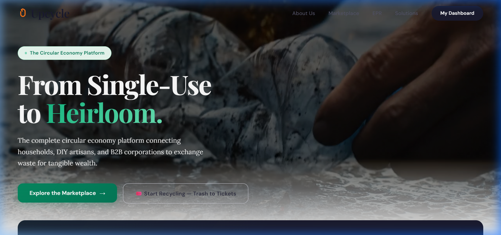
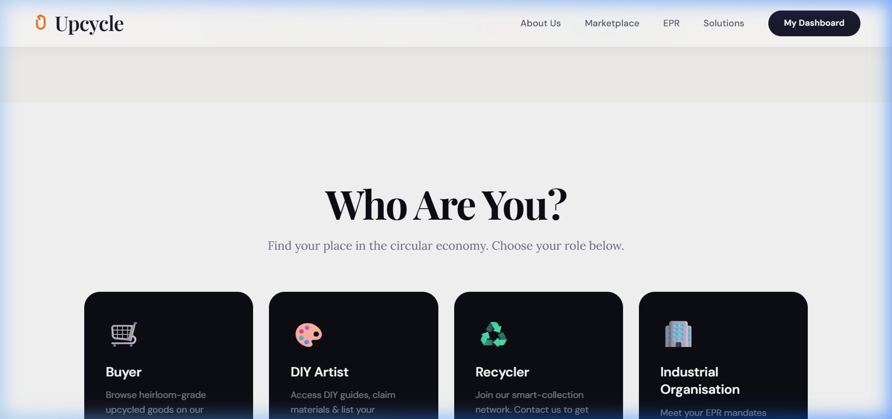
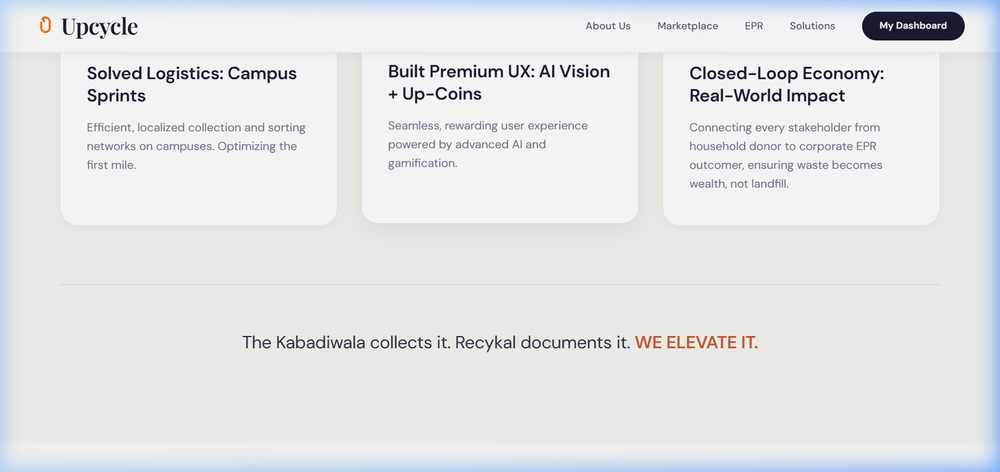

# Upcycle: Circular Economy Platform

## The Problem (PS)
India generates over 9.46 million tonnes of plastic waste annually, yet a massive 40% remains completely uncollected. This fragmented recycling loop leaves an enormous environmental footprint. Disjointed rural logistics and a lack of transparency cause a majority of potentially valuable plastics to vanish into landfills rather than being repurposed.

## Our Solution
**Upcycle** is a closed-loop circular economy engine that turns plastic waste into wealth and measurable impact. We seamlessly connect every stakeholder in the timeline — from the household donor dropping a bottle, to the artisan transforming it, to the corporate organization proudly claiming its Extended Producer Responsibility (EPR) offsets. 

## Our USP: The Heirloom-Grade Marketplace
While traditional recycling often "downcycles" materials into lower-grade uses, **Upcycle elevates waste** into luxury, heirloom-grade goods (such as Terrazzo homeware, woven tote bags, and designer artisan watches).

In our verified marketplace, every product carries an **NFC digital passport** mapping its entire journey from the collection bin to the buyer's shelf. 

**What makes it truly revolutionary?** Our automated royalty engine. Whenever an upcycled luxury good is sold on the marketplace, the system instantly triggers a **return royalty (Up-Coins/Payback)** directly back to the original household donor who contributed the raw plastic. 

---

## Features Visualized

### 1. AI-Driven Gamified Collection

*We run optimized **Campus Sprints** where smart AI-driven bins process and categorize plastic deposits instantly, crediting contributors with **Up-Coins** for gamified rewards.*

### 2. Tailored Portals for Every Stakeholder

*The platform ecosystem is purposely built for multiple roles:*
*   **Buyers**: Browse transparently sourced upcycled goods on our marketplace.
*   **DIY Artists**: Claim recycled materials and upcycle them alongside our open-source 3D manuals.
*   **Recyclers / Campus Leaders**: Organize local collection sprints.
*   **Industrial Organizations (B2B)**: Sponsor sprints to transparently meet EPR mandates.

### 3. Why We Win

***Solved Logistics**: Efficient localized operations at the campus level.*
***Premium UX**: Seamless user experience powered by AI classification.*
***Closed-loop Engine**: "The Kabadiwala collects it. Recykal documents it. WE ELEVATE IT."*

---

## Running the Project Locally

To test out the UI and front-end interface natively on your machine:

```bash
# Install Dependencies
npm install

# Start the Development Server
npm run dev
```

*Built specifically with React, Vite, Lucide React, and a powerful custom CSS Design System.*
